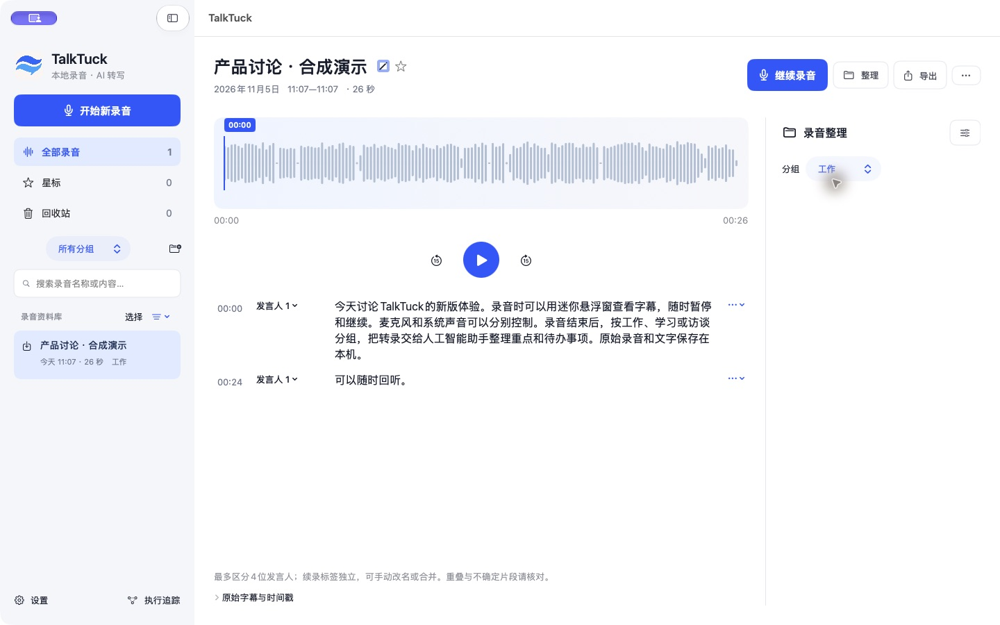
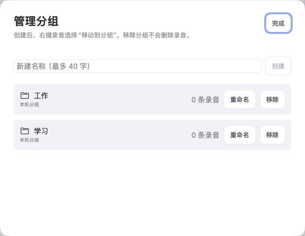
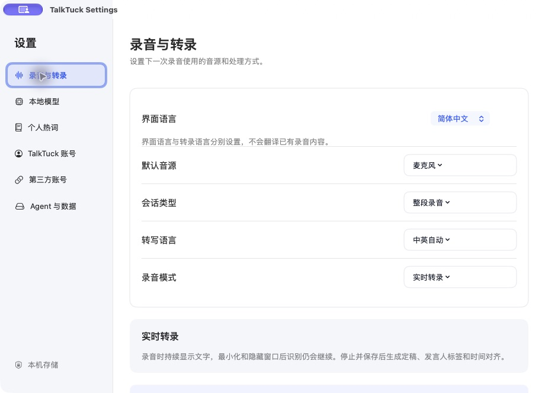

# TalkTuck for macOS

把声音留下来，把转录交给你习惯的 Agent。

本仓库公开 TalkTuck 的 macOS 原生客户端、构建脚本与相关文档。iPhone、Apple Watch 和服务端属于独立工程。

[产品介绍](https://xueshengguo.com/apps/talktuck/) · [个人主页](https://xueshengguo.com/) · [GitHub Releases](https://github.com/xsg22/talktuck/releases)

**[下载 0.17.2（44）](https://github.com/xsg22/talktuck/releases/tag/v0.17.2)** · [DMG](https://github.com/xsg22/talktuck/releases/download/v0.17.2/TalkTuck-0.17.2-arm64.dmg) · [PKG](https://github.com/xsg22/talktuck/releases/download/v0.17.2/TalkTuck-0.17.2-arm64.pkg)

适用于 Apple Silicon、macOS 14 或更新版本。Python 3.12 和语音引擎随包提供，首次使用仍需下载模型。当前发布为主功能验证版，采用本地签名，尚未 Apple 公证。

主分支正在准备下一版统一命名迁移；已发布版本的 Agent 接入请使用应用内复制的提示词，按其返回的实际路径安装。

## 录音、转录和分组

- 麦克风、系统声音或两路一起录，录音中可分别控制音源。
- mini 悬浮窗显示实时字幕，支持暂停、继续和停止保存。
- 导入音频、按段回听、校正转录，导出 Markdown、文本或字幕。
- 用分组、搜索和星标管理录音；原音与文字保存在本机。
- 通过 Skill、CLI 或 MCP，让本机 Agent 查询定稿并按需整理重点。

以下为 0.17.2（44）正式客户端的实际截图，使用隔离资料目录和合成语音。资料库图中的产品名及待办字样经过原生编辑器人工校正，不代表全部识别结果无需核对。







界面支持简体中文和 English，与转录语言分别设置。TalkTuck 账号、第三方账号、个人热词与 Agent 接入在设置中分别管理。

## Agent 接入

在应用中复制接入提示词，发给当前使用的本机 Agent。由 Agent 获取 Skill、安装到自己的环境，并分别确认加载和转录查询；读取内容不需要启动录音或上传原音。

当前源码的命令名与 Skill 名为 `talktuck`，MCP 资源使用 `talktuck://`。CLI 的 `setup --json` 提供实际路径与完整安装文件，避免手工猜测位置。开始录音需要用户明确指令，队列受理与实际录音状态分别查询。详见[接口说明](Docs/Agent接口.md)。

## 开发与验证

需要 Apple Silicon、macOS 14+、Xcode 命令行工具和 Python 3.12。官方账号组件放入配置的依赖目录，构建会检查固定版本和 SHA-256。模型、依赖二进制、安装包及用户资料不纳入 Git。

在独立构建工作区为 `.build`、`dist` 和依赖目录配置外部输出位置，并显式设置 `TMPDIR`、工具缓存；已有目录不得被构建脚本自动迁移。详见[构建与发布](Docs/发布流程.md)。

```zsh
python3 Scripts/test-recording-entry.py
zsh Scripts/test-library-management.zsh
zsh Scripts/release.zsh --candidate
```

本地候选构建不等于发布。完整 UI 与主功能发布门禁继续保留；历史执行原件已归档，不能作为新命名版本的通过证据。见[本轮迁移说明](Docs/统一命名迁移.md)和[UI 验收状态](Docs/UI验收.md)。

已发布包的下载复测与下一版候选验证分别保存在[本轮验证记录](Docs/validation/current/README.md)。

## 联系方式

邮箱：[xsgnzb1@gmail.com](mailto:xsgnzb1@gmail.com)

微信公众号：**李昂的数字之旅**。


